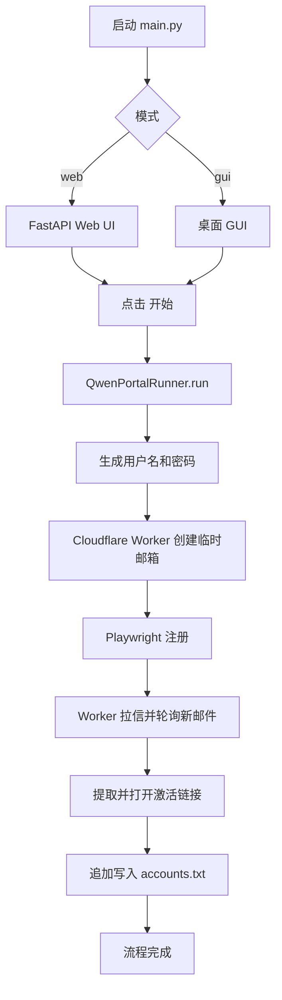

# qwen-auto-register 代码结构说明

本文档描述当前精简版架构：自动注册 Qwen 账号，完成邮箱激活后，将账号密码保存到本地文本文件。

## 1. 当前目录结构

```text
qwen-auto-register/
├── config.json
├── README.md
├── ARCHITECTURE.md
├── Dockerfile
├── docker-compose.yml
├── scripts/
│   └── start.ps1
└── src/
    └── auto_register/
        ├── config.py
        ├── main.py
        ├── web/
        │   ├── __init__.py
        │   └── app.py
        ├── gui/
        │   ├── app.py
        │   └── log_panel.py
        ├── providers/
        │   ├── one_sec_mail_provider.py
        │   └── username_provider.py
        ├── integrations/
        │   ├── qwen_portal.py
        │   ├── cli_proxy_management_client.py
        │   └── ARCHIVED_LEGACY.md
        ├── writer/
        │   ├── accounts_writer.py
        │   └── ARCHIVED_LEGACY.md
        └── archive/
            ├── README.md
            └── legacy/
```

`cli_proxy_management_client.py` 仍在源码中保留，但当前活动流程不再调用远程 CLI Proxy API。

## 2. 当前活动流程

1. 自动注册
2. 自动激活
3. 本地保存 `email:password`



## 3. 核心模块职责

- `src/auto_register/config.py`
  - 读取当前项目根目录 `config.json`，提供 Worker 邮箱与本地账号输出配置。

- `src/auto_register/integrations/qwen_portal.py`
  - 主编排器：注册、等待激活邮件、打开激活链接、保存本地账号。

- `src/auto_register/providers/one_sec_mail_provider.py`
  - Cloudflare Worker 邮箱适配：创建临时邮箱、拉取邮件、按快照轮询新邮件、提取激活链接。

- `src/auto_register/writer/accounts_writer.py`
  - 将激活成功的 `email:password` 追加写入本地文本文件。

- `src/auto_register/providers/username_provider.py`
  - 随机用户名生成。

- `src/auto_register/web/app.py`
  - Web 控制台：启动任务、停止任务、查看实时日志和运行状态。

## 4. 关键配置

当前项目使用 `config.json` 配置 Worker 邮箱和账号输出：

```json
{
  "cf_worker_domain": "mail.example.com",
  "cf_email_domain": [
    "example.com"
  ],
  "cf_admin_password": "replace-with-admin-password",
  "cf_enable_random_subdomain": true,
  "accounts_file": "accounts.txt"
}
```

`.env` 继续用于 UI 模式、端口和浏览器代理等运行时配置。

## 5. 非活动链路

以下能力已从当前活动流程中移除或归档：

- 远程 CLI Proxy API 登录链接认证
- CPA 上传
- 本地 OAuth 认证文件写入
- LuckMail
- Outlook 邮箱池
- Mail.tm / 1secMail
